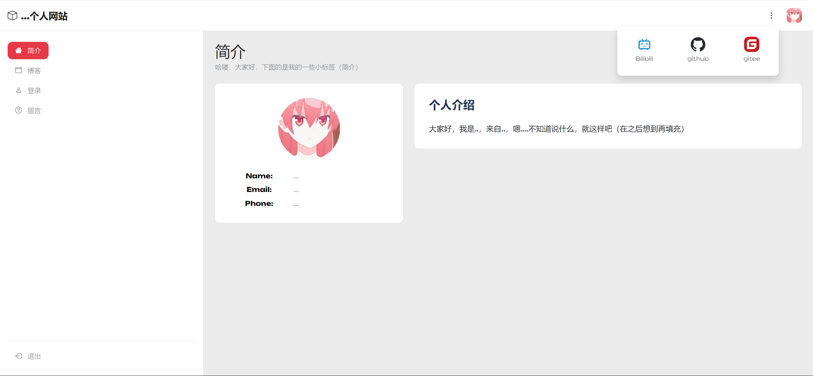

# xhk-web

本次大作业是一个简单的前端项目，主题为设计和开发个人网站。项目包含多个栏目，涵盖了个人信息展示、博客、登录、留言等功能。由Vue CLI脚手架工具搭建项目，使用Vue.js框架（Vue2）进行组件化开发，通过Vue Router实现了多页面的路由切换，运用Bootstrap框架提供的栅格系统和组件，实现了响应式设计。留言功能通过Vue.js的数据绑定和动态渲染实现。

实际效果可自行运行下列命令进行查看：

```cmd
npm install
npm run serve
```

下图是主页展示



另外附上原html模板的链接（我将其简化为一个简单的个人网页模板，并修改成使用vue框架，如上图所示）：

https://www.tooplate.com/view/2135-mini-finance

## Project setup
```
npm install
```

### Compiles and hot-reloads for development
```
npm run serve
```

### Compiles and minifies for production
```
npm run build
```

### Lints and fixes files
```
npm run lint
```

### Customize configuration
See [Configuration Reference](https://cli.vuejs.org/config/).
